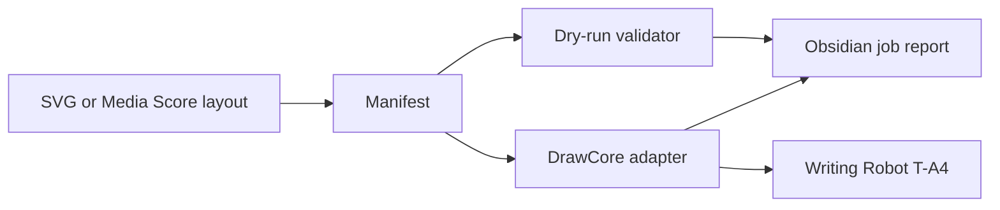

# Writing Robot T-A4 Reverse Engineering Plan

## Position

We should escape Inkscape by reversing the narrow DrawCore device path, not by cloning or depending on the Inkscape extension UI.

The installed iDraw 2.0 extension is useful as an evidence source, but the robust system should own:

- device discovery
- device profile
- SVG or layout normalization
- job manifests
- dry-run validation
- command streaming
- job logs

Inkscape should become one optional SVG authoring source.

## What To Reverse First

### 1. DrawCore transport

Evidence from the installed iDraw 2.0 driver:

- serial discovery matches `1A86:7523` and `1A86:8040`
- attached candidate is `1A86:8040`
- outbound macOS path is likely `/dev/cu.usbmodem201912341`
- baud rate is `115200`
- the driver expects firmware strings beginning with `DrawCore V`
- response handling is line-oriented and expects `ok` after most commands
- confirmed firmware response: `DrawCore V2.21.20250612`
- confirmed status response: `<Idle|MPos:0.000,0.000,0.000|FS:0,0|Pn:Y|WCO:0.000,0.000,0.000>`

This is a small enough surface to reimplement cleanly.

### 2. Command vocabulary

Known command shapes from the installed driver:

| Purpose | Command shape | Terminator | Motion risk |
| --- | --- | --- | --- |
| Firmware query | `V` | `CR` | none |
| Status query | `?` | `CR` | none |
| Unlock alarm | `$X` | `CR` | state change |
| Button query | `$B` | `CR` | none |
| Pen state query | `$QP` | `CR` | none |
| Nickname query | `$QT` | `CR` | none |
| Nickname write | `$ST` plus equals sign plus `<name>` | `CR` | persistent state change |
| Sleep / disable motors | `$SLP` | `CR` | state change |
| Home | `$H` | `CR` | motion |
| Reset defaults | `$RST` plus equals sign plus `*` | `CR` | persistent state change |
| Settings dump | `$$` | `CR` | none |
| Pen up/down | `G1G90 Z<mm>F<speed>` | `CR` | Z motion |
| Set feed | `G1 F<speed>` | `CR` | modal state change |
| Relative XY | `G1G91X<mm>Y<mm>F<speed>` | `CR` | XY motion |
| Dwell | `G4 P<seconds>` | `CR` | time only |
| PWM output | `G1 F<speed> M3 S<value>` | `CR` | output state change |

The first adapter should implement only the no-motion commands until the query/response loop is boring.

### 3. Coordinate convention

The iDraw 2.0 driver does not simply stream SVG coordinates as millimeters. It processes SVG into paths, plans motion in inches, converts through native motor axes, and finally sends relative G-code-like moves.

Key implication:

- v1 of our independent tool should use normalized millimeter coordinates at the manifest boundary
- the DrawCore adapter should own any final machine convention
- curves should be flattened before streaming
- do not rely on G2/G3 arc commands

### 4. Motion planner

The installed driver contains a full acceleration/cornering planner. We should not copy it wholesale.

Recommended first implementation:

1. generate flat line segments
2. use conservative feed rates
3. stream simple relative linear moves
4. add planner sophistication only after empirical tests show a need

This keeps the adapter small and testable.

## Immediate Implementation

The first non-Inkscape tool is now:

```bash
npm run plotter:probe -- --markdown
```

It only inspects `/dev` and macOS USB registry output. It does not open serial ports or send device commands.

Expected current result:

- likely device: `/dev/cu.usbmodem201912341`
- USB candidate: `USB CDC_Serial`
- VID/PID: `0x1A86` / `0x8040`
- DrawCore match: `true`
- generated reports use human-facing command notation like `V + CR`; the probe still sends the actual carriage-return-terminated serial bytes.

## Confirmed No-Motion Serial Query

The gated serial query is implemented:

```bash
npm run plotter:probe -- --query-device --port /dev/cu.usbmodem201912341
```

Rules:

- it may send `V` followed by `CR`
- it may send `?` followed by `CR`
- it must not send motion, homing, motor, pen, unlock, or write commands
- it must print every command sent and every raw response received
- it must write a timestamped report under `artifacts/plotter/`

Latest confirmed report:

- `artifacts/plotter/device-probe-2026-04-11T15-25-03-648Z.md`
- opened serial port: `true`
- allowed commands: `V + CR`, `? + CR`
- firmware: `DrawCore V2.21.20250612`
- status: `Idle`
- machine position: `0.000,0.000,0.000`
- feed/spindle: `FS:0,0`
- pin flag: `Pn:Y`
- response parser extracts firmware, status state, machine position, feed/spindle, pin flags, and any optional `WCO` or `Ov` fields when present

This confirms that the installed driver assumptions are enough to proceed with a clean DrawCore transport adapter.

## Confirmed No-Motion SVG Dry Run

The SVG dry-run manifest generator is now:

```bash
npm run plotter:manifest -- --svg fixtures/plotter/simple-shapes.svg --markdown
```

Rules:

- it does not open serial ports
- it does not send device commands
- it does not move the plotter
- it parses the SVG page size, viewBox, basic drawable geometry, bounds, travel distance, draw distance, and unsupported features
- it writes JSON or Markdown reports under `artifacts/plotter/`

Latest fixture reports:

- `artifacts/plotter/manifest-simple-shapes-2026-04-11T15-35-47-801Z.json`
- `artifacts/plotter/manifest-simple-shapes-2026-04-11T15-35-57-332Z.md`

Fixture result:

- page: `300 x 210 mm`
- coordinate mapping: `viewBox scaled into declared page size`
- shapes: `5`
- segments: `91`
- pen lifts: `5`
- draw distance: `503.700 mm`
- travel distance: `261.439 mm`
- bounds: `X 10.000..250.000 mm`, `Y 10.000..70.000 mm`
- out of bounds: `false`
- unsupported feature detected: `text`

This gives us a real preflight surface before any motion work.

## Media Score Output Device Integration

The Media Score app now has a typed no-motion output-device profile:

- file: `media-score-studio/Sources/Models/PlotterOutputDevice.swift`
- profile ID: `writing-robot-t-a4-drawcore`
- route: `scene.geometry[plotter-layout] -> svg -> plotter-manifest`
- required checks: `device-probe`, `svg-manifest-dry-run`, `bounds-check`, `unsupported-feature-check`
- sample output artifact: `papercraft-plotter.manifest.json`
- app doc: `media-score-studio/Docs/Plotter-Output-Device.md`
- abstract API doc: `media-score-studio/Docs/Device-Target-API.md`
- abstract API model: `media-score-studio/Sources/Models/DeviceTargetAPI.swift`
- Node and TypeScript API: `tools/plotter/index.ts`
- bash wrapper: `tools/plotter/plotter.sh`

This keeps the app integration aligned with the CLI proof points while leaving real device motion behind an explicit future armed path.

## What Not To Reverse Yet

- the full Inkscape extension UI
- the whole iDraw path optimizer
- resume metadata embedded in SVG
- multi-machine plotting
- laser / PWM behavior
- homing behavior
- settings reset or nickname writes

Those can wait until the base transport and manifest are reliable.

## Decision

Proceed with a clean local adapter.

Use the installed driver as a map, but keep the production tool independent:


