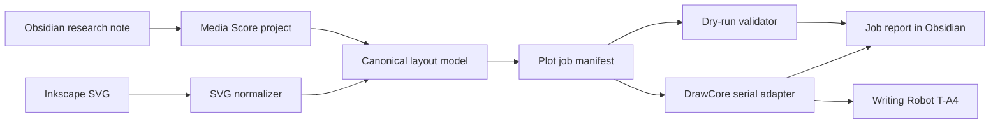
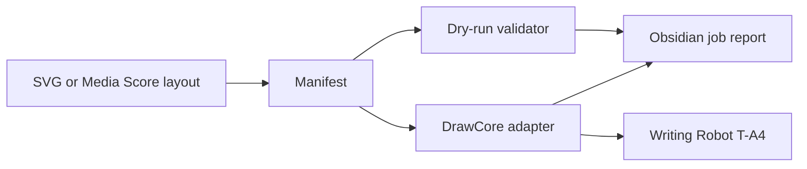

# Writing Robot T-A4 Workflow Map

## Purpose

This note maps a practical tool direction for the Writing Robot T-A4 plotter and its place in the current graphics and papercraft workflow.

The immediate goal is not to replace Inkscape in one jump. It is to stop treating Inkscape extensions as the whole system and start treating them as one adapter into a larger, inspectable plotter workflow.

## Local Evidence

### Current Inkscape install

The active Inkscape profile contains both AxiDraw and iDraw extensions:

- `axidraw_control.py`
- `axidraw_conf.py`
- `idraw_control.py`
- `idraw_conf.py`
- `idraw2_0_control.py`
- `idraw2_0_conf.py`
- `idraw_deps/idraw2_0internal/`
- `drawcore_plotink/`

This matters because the current working route is not a generic GUI automation route. The useful route is already exposed in installed extension code.

### Connected device

macOS currently exposes one likely plotter serial device:

- `/dev/cu.usbmodem201912341`
- `/dev/tty.usbmodem201912341`

USB registry details:

- product: `USB CDC-Serial`
- vendor ID: `0x1A86`
- product ID: `0x8040`
- serial: `20191234`

The installed `drawcore_serial.py` explicitly searches for:

- `USB VID:PID 1A86:7523`
- `USB VID:PID 1A86:8040`

That strongly suggests the direct-control layer should target the installed iDraw 2.0 DrawCore path first.

### Device protocol shape

The installed iDraw 2.0 code uses `drawcore_plotink`, not the older pure AxiDraw EBB path.

Important behavior seen locally:

- serial is opened at `115200`
- version query sends `V` followed by `CR`
- general status query sends `?` followed by `CR`
- firmware strings are expected to start with `DrawCore V`
- setup and plot commands are G-code-like

This is not plain HPGL. It is also not exactly the original AxiDraw EBB command set. Treat it as a DrawCore adapter until direct device tests prove otherwise.

### A4 bounds and settings

The installed iDraw 2.0 configuration describes the A4 model as:

- default X travel: `11.81 in`, about `300 mm`
- default Y travel: `8.27 in`, about `210 mm`
- speed values in `mm/min`
- pen-up/down positions in `mm`
- motor resolution labels around `2870 DPI` and `1435 DPI`

The older iDraw extension exists too, but the 2.0 extension looks more aligned with the attached `1A86:8040` DrawCore route.

## Decisions

### 1. Do not build around Inkscape Accessibility

Use Inkscape as a drawing and compatibility tool, but do not make Accessibility automation the primary integration layer.

Reasons:

- the installed extensions already expose serial and SVG processing logic
- GUI automation would be brittle and hard to test
- a direct adapter can support dry runs, manifests, safety checks, and job history

Accessibility may still be useful for one-time observation of current UI state, but it should not be the workflow foundation.

### 2. Treat the plotter as a first-class connector target

This should feed `Media Score Studio` as a real `ConnectorTarget`, not as a hidden export side effect.

The target should carry:

- model: `Writing Robot T-A4 / iDraw A4`
- transport: `serial`
- port selector: explicit device path or VID/PID discovery
- working area: `300 mm x 210 mm`
- origin convention
- pen-up/down calibration
- speed presets
- pause/resume behavior

### 3. Build a CLI before app UI

The first robust tool should be a local CLI, probably under `tools/plotter/`, before any macOS UI work.

The CLI should support:

- `probe`: list likely devices without motion
- `version`: query firmware without motion
- `dry-run`: parse SVG and produce a job report without opening serial
- `manifest`: convert an SVG into an explicit plot job manifest
- `plot`: execute a manifest, gated by an explicit `--armed` flag
- `pause-state`: inspect or clear locally tracked job state

This lets Obsidian, shell scripts, and the app all call the same tool.

### 4. Use a manifest as the workflow contract

The robust boundary should be a plot job manifest, not a raw SVG.

Manifest fields should include:

- source artifact path
- normalized page size
- device profile
- layer policy
- paths or segments after flattening
- pen actions
- speed policy
- bounds report
- estimated travel distance
- estimated pen lifts
- execution log path
- source note links

This gives us a stable place for validation, review, and resume metadata.

### 5. Keep plot semantics above device commands

The app and notes should keep using semantic geometry:

- draw
- cut
- fold
- score
- registration
- annotation

The DrawCore adapter should be the last step that maps those semantics into pen paths and machine commands.

## Proposed Architecture

## Suite Shape

### Phase 1: Device reconnaissance

Build non-moving tools first:

- list serial ports
- match VID/PID
- query DrawCore firmware
- query nickname if supported
- record local profile as a YAML or JSON device preset

No motors, no pen movement, no homing.

### Phase 2: Artifact pipeline

Build SVG-to-manifest without device motion:

- parse page size and viewBox
- normalize units to millimeters
- flatten paths
- respect layer policy
- report out-of-bounds geometry
- report unsupported features such as text, images, clipping, or fills
- preserve source note links

### Phase 3: Safe motion primitives

Add explicitly armed commands:

- raise pen
- lower pen
- disable motors
- tiny relative movement fixture
- home only when there is a clear, documented physical origin assumption

Every command should log what it sent and what came back.

### Phase 4: Real plotting

Execute a manifest:

- preflight bounds
- require an `--armed` flag
- raise pen before travel

## Live Validation Run

### Date

- `2026-04-12`

### Result

A live SVG plot run completed after correcting the machine mapping.

### What changed

- the first live plot path was mirrored incorrectly on X and drove toward the hard stop
- the executor was corrected to mirror SVG coordinates into machine coordinates before streaming motion
- the run was repeated with the supported full plot fixture and completed cleanly

### Fixture used

- `fixtures/plotter/full-plot.svg`

### Observed toolpath shape

- 5 shapes
- 91 segments
- 5 pen lifts
- no unsupported features
- no out-of-bounds geometry

### Current command surface

- `tools/plotter/plotter.sh probe`
- `tools/plotter/plotter.sh manifest --svg fixtures/plotter/simple-shapes.svg --markdown`
- `tools/plotter/plotter.sh cycle --svg fixtures/plotter/pen-cycle.svg --live --markdown`
- `tools/plotter/plotter.sh plot --svg fixtures/plotter/full-plot.svg --live --markdown`

### Notes from the run

- the pen-cycle fixture remains useful as the smallest actuator-only check
- the full-plot fixture is now the useful end-to-end SVG smoke test
- the machine should be treated as viewport-mapped, not as a raw SVG coordinate dump

## What Not To Reverse Yet

- the full Inkscape extension UI
- the whole iDraw path optimizer
- resume metadata embedded in SVG
- multi-machine plotting
- laser / PWM behavior
- homing behavior
- settings reset or nickname writes

Those can wait until the base transport and manifest are reliable.

## Decision

Proceed with a clean local adapter.

Use the installed driver as a map, but keep the production tool independent:

